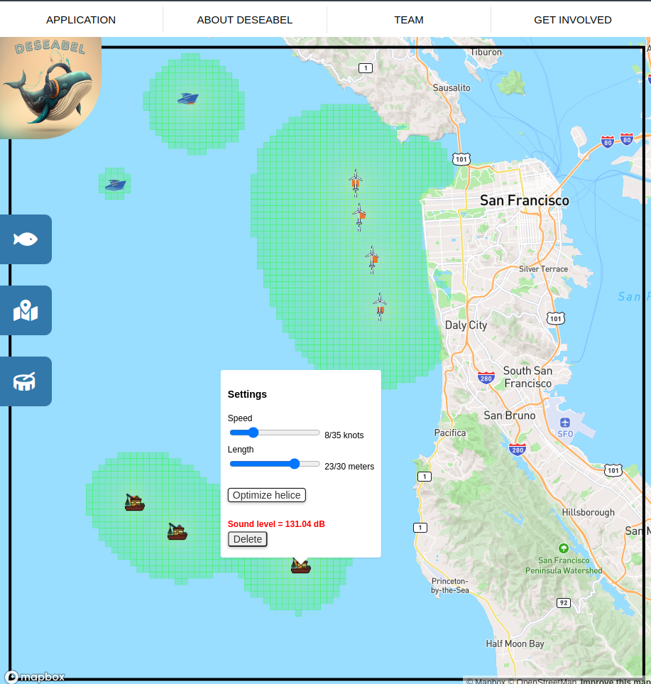

# DeSEAbel: Reducing Ocean Noise Pollution
DeSEAbel is a free and open source application designed to help individuals and organizations monitor and reduce the volume of human-generated noise in the oceans. With its user-friendly interface and powerful features, DeSEAbel empowers you to take action towards protecting our oceans and marine life.

## Key Features
1. **World Map**: Choose from a range of regions on the world map to focus your efforts on specific areas.
2. **Human Activity Marker**s: Plot markers representing human-generated sonor activities such as boats, shipping lanes, and wind turbines, to better understand the sources of noise pollution in your area of interest.
3. **Marine Fauna Plots**: Visualize the presence of marine fauna using geojson data and plot it on the map. This feature allows you to understand the impact of noise pollution on local wildlife populations.

## How to Use DeSEAbel
To get started with DeSEAbel, simply go to [Deseabel website](https://deseabel.github.io/deseabel/visualization/), select your region of interest on the world map, and start plotting markers and geojson data. With each marker and data plot, you will gain a deeper understanding of the sources of noise pollution and the impact on marine life.

## Contributing to DeSEAbel
DeSEAbel is an open-source application, and we welcome contributions from the community. If you're interested in helping us make DeSEAbel better, please get in touch with us through our GitHub repository.

## Conclusion
The ocean is a critical component of our planet's ecosystem, and human-generated noise pollution is a growing threat to its health. DeSEAbel provides a powerful tool for individuals and organizations to take action towards reducing this threat and protecting our oceans and marine life.